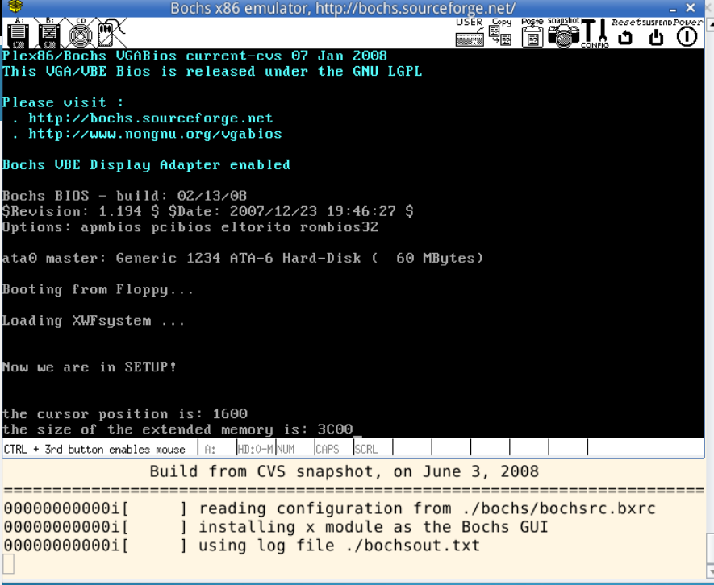

# 实验一和实验二
一共涉及到三个文件的修改，分别是linux-0.11/boot下的bootsect.s、setup.s以及linux-0.11/bools下的build.c。

## bootsect.s
只需要修改msg1的内容，再将cx该为对应的ascii码数即可

## setup.s
相当于复制了一遍bootsect.s中输出信息的内容，将本实验中不需要的代码删除。

## build.c
在build.c的尾部修改以下代码
```c
//  if ((id=open(argv[3],O_RDONLY,0))<0)
//      die("Unable to open 'system'"); 改为
if((id=open(argv[3],O_RDONLY,0))==0)
    return 0;
```
## 结果
最终的结果如下
