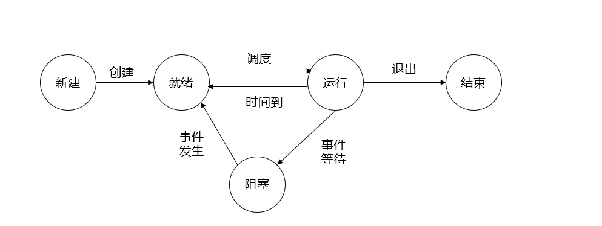

# 实验4 进程运行轨迹的跟踪与统计
[TOC]

完成这个实验后对进程切换的过程有了非常清楚的了解

## 进程切换
进程的运行状态有五种：新建（N）、就绪（J）、运行（R）、阻塞（W）、结束（E），各种状态之间的切换如下图所示：

在linux0.11中，阻塞状态有两种，分别是TASK_INTERRUPTIBLE和TASK_UNINTERRUPTIBLE，这两种状态的区别是不可中断的睡眠只能由wake_up显式唤醒，就绪状态为TASK_RUNNING，正在运行的进程由全局变量current指明。
fprintk(3, "%ld\t%c\t%ld\n", current->pid, 'R', jiffies); 
## 寻找进程切换点
设计到的源代码有kernel目录下的fork.c、sched.c、exit.c

### fork.c
fork()是系统调用，在内核中由sys_fork()实现，而sys_fork又调用了copy_process()实现新进程的创建。在copy_process()中有以下代码，实现了进程的新建和就绪状态的切换。
``` c
int copy_process(int nr,long ebp,long edi,long esi,long gs,long none,
        long ebx,long ecx,long edx,
        long fs,long es,long ds,
        long eip,long cs,long eflags,long esp,long ss)
{
    struct task_struct *p;
    int i;
    struct file *f;
    //创建新进程
    p = (struct task_struct *) get_free_page();
    if (!p)
        return -EAGAIN;
    task[nr] = p;
    *p = *current;  /* NOTE! this doesn't copy the supervisor stack */

    p->state = TASK_UNINTERRUPTIBLE;
    //···
    //进程就绪
    p->state = TASK_RUNNING;    /* do this last, just in case */
```

### schec.c
sched.c是内核中有关任务调度函数的程序，其中包含有关调度的基本函数(sleep_on、wake_up、schedule等)。
```c
void schedule(void)
{
    //...
    for(p = &LAST_TASK ; p > &FIRST_TASK ; --p)
        if (*p) {
            if ((*p)->alarm && (*p)->alarm < jiffies) {
                    (*p)->signal |= (1<<(SIGALRM-1));
                    (*p)->alarm = 0;
                }
            if (((*p)->signal & ~(_BLOCKABLE & (*p)->blocked)) &&
            (*p)->state==TASK_INTERRUPTIBLE)
            {
                (*p)->state=TASK_RUNNING;
                //唤醒不可中断的进程，状态变为就绪
                fprintk(3, "%ld\t%c\t%ld\n", p->pid, 'J', jiffies); 
            }
        }

    //...
    //start
    //next是找到的下一个要运行的程序，可能是current本身
    if(task[next]!=current)
    {
        if(current->state==TASK_RUNNING)
            //如果current没有被阻塞，那么它从运行转变为就绪
            fprintk(3, "%ld\t%c\t%ld\n", current->pid, 'J', jiffies); 
        fprintk(3, "%ld\t%c\t%ld\n", task[next]->pid, 'R', jiffies); 

    }
    //end
    switch_to(next);
}

int sys_pause(void)
{
    //系统主动阻塞了正在运行的进程
    if(current->state!=TASK_INTERRUPTIBLE)
    {
        //考虑到0号进程在空闲时会不断调用sys_pause()
        fprintk(3, "%ld\t%c\t%ld\n", current->pid, 'W', jiffies); 
    }
    
    //pause系统调用，转换当前任务的状态为可中断的等待信号，并重新调度
    current->state = TASK_INTERRUPTIBLE; 
    schedule();
    return 0;
}

void sleep_on(struct task_struct **p)
{
    //把任务置位不可中断的等待状态，并让睡眠队列头的指针指向当前任务。
    struct task_struct *tmp;

    if (!p)
        return;
    if (current == &(init_task.task))
        panic("task[0] trying to sleep");
    tmp = *p;
    *p = current;
    fprintk(3, "%ld\t%c\t%ld\n", current->pid, 'W', jiffies); 
    current->state = TASK_UNINTERRUPTIBLE;
    schedule();
    if (tmp)
    {
        tmp->state=0;
        fprintk(3, "%ld\t%c\t%ld\n", tmp->pid, 'J', jiffies); 
    }
}

void interruptible_sleep_on(struct task_struct **p)
{
    struct task_struct *tmp;

    if (!p)
        return;
    if (current == &(init_task.task))
        panic("task[0] trying to sleep");
    tmp=*p;
    *p=current;
repeat: current->state = TASK_INTERRUPTIBLE;
    fprintk(3, "%ld\t%c\t%ld\n", current->pid, 'W', jiffies); /* sleep */
    schedule();
    if (*p && *p != current) {
        (**p).state=0;
        fprintk(3, "%ld\t%c\t%ld\n", (**p).pid, 'J', jiffies); /* start running */
        goto repeat;
    }
    *p=NULL;
    if (tmp)
    {
        tmp->state=0;
        fprintk(3, "%ld\t%c\t%ld\n", tmp->pid, 'J', jiffies); /* start running */
    }
}

void wake_up(struct task_struct **p)
{
    if (p && *p) {
        (**p).state=0;
        fprintk(3, "%ld\t%c\t%ld\n", (**p)->pid, 'J', jiffies); /* start running */
        *p=NULL;
    }
}
```

### exit.c
```c
int do_exit(long code)
{
    //...
    current->state = TASK_ZOMBIE;

    fprintk(3, "%ld\t%c\t%ld\n", current->pid, 'E', jiffies); /* exit */

    current->exit_code = code;
    tell_father(current->father);
    schedule();
    return (-1);    /* just to suppress warnings */
}

int sys_waitpid(pid_t pid,unsigned long * stat_addr, int options)
{
    //...
    if (flag) {
        if (options & WNOHANG)
            return 0;
        current->state=TASK_INTERRUPTIBLE;

        fprintk(3, "%ld\t%c\t%ld\n", current->pid, 'W', jiffies); /* sleep */
        
        schedule();
        if (!(current->signal &= ~(1<<(SIGCHLD-1))))
            goto repeat;
        else
            return -EINTR;
    }
    return -ECHILD;
}
```

## 修改文件
按照教程修改文件
### kernel.h和printk.c
```c
//在kernel.h中添加fprintk的声明：
int fprintk(int fd,char *fmt,...);

//在printk.c中加入fprintk函数
#include "linux/sched.h"
#include "sys/stat.h"

static char logbuf[1024];
int fprintk(int fd, const char *fmt, ...)
{
    va_list args;
    int count;
    struct file * file;
    struct m_inode * inode;

    va_start(args, fmt);
    count=vsprintf(logbuf, fmt, args);
    va_end(args);

    if (fd < 3)    /* 如果输出到stdout或stderr，直接调用sys_write即可 */
    {
        __asm__("push %%fs\n\t"
            "push %%ds\n\t"
            "pop %%fs\n\t"
            "pushl %0\n\t"
            "pushl $logbuf\n\t" /* 注意对于Windows环境来说，是_logbuf,下同 */
            "pushl %1\n\t"
            "call sys_write\n\t" /* 注意对于Windows环境来说，是_sys_write,下同 */
            "addl $8,%%esp\n\t"
            "popl %0\n\t"
            "pop %%fs"
            ::"r" (count),"r" (fd):"ax","cx","dx");
    }
    else    /* 假定>=3的描述符都与文件关联。事实上，还存在很多其它情况，这里并没有考虑。*/
    {
        if (!(file=task[0]->filp[fd]))    /* 从进程0的文件描述符表中得到文件句柄 */
            return 0;
        inode=file->f_inode;

        __asm__("push %%fs\n\t"
            "push %%ds\n\t"
            "pop %%fs\n\t"
            "pushl %0\n\t"
            "pushl $logbuf\n\t"
            "pushl %1\n\t"
            "pushl %2\n\t"
            "call file_write\n\t"
            "addl $12,%%esp\n\t"
            "popl %0\n\t"
            "pop %%fs"
            ::"r" (count),"r" (file),"r" (inode):"ax","cx","dx");
    }
    return count;
}
```

### 修改main.c
```c
/***************添加开始***************/
setup((void *) &drive_info);
(void) open("/dev/tty0",O_RDWR,0);    //建立文件描述符0和/dev/tty0的关联
(void) dup(0);        //文件描述符1也和/dev/tty0关联
(void) dup(0);        //文件描述符2也和/dev/tty0关联
(void) open("/var/process.log",O_CREAT|O_TRUNC|O_WRONLY,0666);
/***************添加结束***************/
```

